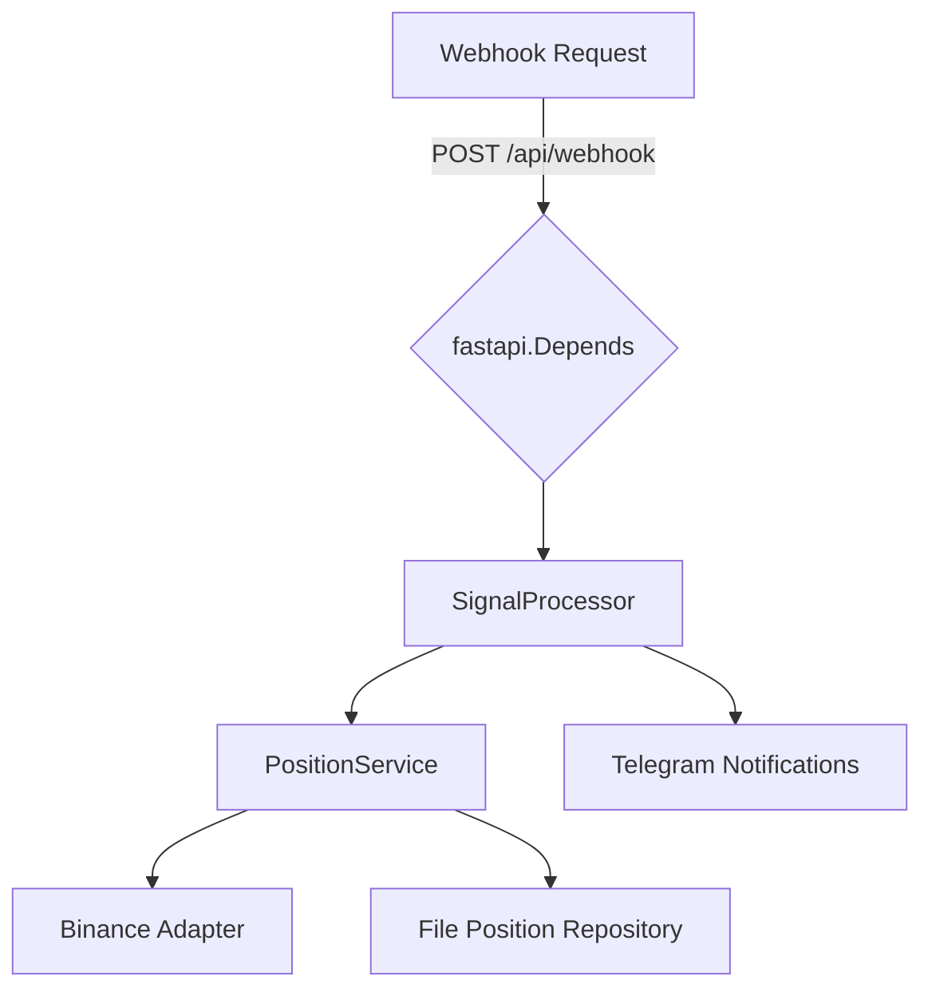

# Architecture & Runtime Orchestration

## Why it matters
AlgoBot coordinates REST APIs, background workers, and a Telegram bot within a single FastAPI deployment. Understanding how startup wiring, dependency injection, and process management work prevents race conditions and clarifies where to hook new functionality.

## Runtime composition

| Layer | Responsibility | Key modules |
| --- | --- | --- |
| Entry point | Creates the FastAPI app, configures logging, and instantiates singletons for adapters, repositories, and services. | [`main.py`](../main.py) |
| Core primitives | Domain models (positions, assets), strongly typed configuration, and logging helpers shared by every other layer. | [`src/core/`](../core) |
| Adapters | Binance spot/futures clients with request signing, rate limiting, and environment-aware factories. | [`src/adapters/binance_adapter.py`](../adapters/binance_adapter.py) |
| Repositories | File-backed persistence built on JSON/CSV mirrors with atomic writes and integrity checks. | [`src/repositories/file_position_repository.py`](../repositories/file_position_repository.py) |
| Services | Business workflows for executing orders and reacting to webhook signals. | [`src/services/`](../services) |
| Interfaces | REST routers, Telegram bot commands, and static frontend views that expose the system. | [`src/api/`](../api), [`src/telegram/`](../telegram), [`src/frontend/`](../frontend) |

## Startup sequence
1. **Environment & logging** – `main.py` loads `.env` values (`dotenv`), ensures the `logs/` directory exists, and calls [`configure_logging`](../core/logging_config.py).
2. **Adapter selection** – [`get_adapter_settings`](../core/config.py) selects the default Binance mode (spot vs. futures, live vs. testnet) before [`create_binance_adapter`](../adapters/binance_adapter.py) builds the shared client.
3. **Repository wiring** – [`create_file_position_repository`](../repositories/file_position_repository.py) prepares the file-backed ledger and caches open positions for quick lookups.
4. **Service instantiation** – [`PositionService`](../services/position_service.py) and [`SignalProcessor`](../services/signal_processor.py) are created with the adapter + repository, forming the heart of trade execution.
5. **Background tasks** – [`create_maintenance_tasks`](../tasks/maintenance_tasks.py) and [`create_safety_tasks`](../tasks/safety_tasks.py) register async loops that run after startup using the same service layer.
6. **Telegram subprocess** – [`get_telegram_bot`](../telegram/telegram_bot.py) spins up a `multiprocessing.Process` so chat commands stay responsive even if the API is busy.
7. **Static assets** – If `src/frontend/static/` exists, FastAPI mounts it at `/static` for the settings console and chart assets.

## Shutdown semantics
Before FastAPI exits, [`close_all_positions_on_shutdown`](../tasks/shutdown_tasks.py) gracefully closes open trades (if enabled) and cancels running background loops, ensuring no dangling file handles or stray orders remain.

## Request flow snapshot

- Webhook routes use `Depends(get_signal_processor)` in [`src/api/webhook.py`](../api/webhook.py) to access the singleton service.
- `PositionService` returns execution results, which propagate back to the API response and notification layer.

## Extending the architecture
- **New exchange** – Implement an adapter matching the methods in [`BinanceAdapter`](../adapters/binance_adapter.py) and update the factory to switch based on configuration.
- **Alternate persistence** – Replace `FilePositionRepository` with a database-backed repository by implementing the same interface and updating the startup wiring.
- **Additional interfaces** – Mount new routers in [`main.py`](../main.py) or register extra Telegram command modules in [`src/telegram/telegram_bot.py`](../telegram/telegram_bot.py).

## Related references
- `src/docs/architecture.md` (legacy detailed diagramming)
- `src/tasks/fix_position_race.py` for ledger health checks triggered during startup